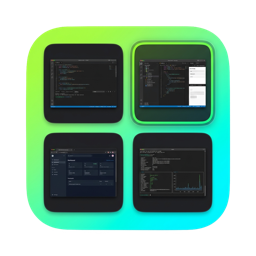
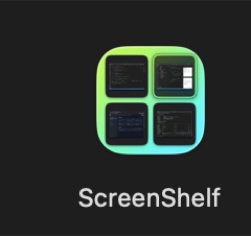

<p align="center">
  
</p>

<h1 align="center">ScreenShelf</h1>

<p align="center">
  Lightweight macOS menu bar app for screenshot history.<br>
  Like <a href="https://maccy.app">Maccy</a>, but for screenshots.
</p>

<p align="center">
  
</p>

## What it does

ScreenShelf watches your screenshot directory and keeps a searchable history with thumbnails. Open it with a keyboard shortcut, select one or more screenshots, and copy them to your clipboard instantly.

- **Cmd+Shift+X** to open/close
- Arrow keys to navigate, Shift+Arrow to extend selection
- Enter to copy selected screenshots
- Escape to dismiss
- **P** to toggle between Image and Path copy modes

## Features

- Monitors your configured screenshot directory (reads `com.apple.screencapture` preference, falls back to `~/Desktop`)
- Real-time detection via FSEvents — new screenshots appear within seconds
- Hardware-accelerated thumbnail generation via CGImageSource on Apple Silicon
- Persistent history via SQLite (GRDB) with WAL mode
- Multi-select: click, Shift+click range, Cmd+click toggle, Shift+Arrow extend/retract
- Copy as image (file URL + PNG data) or copy as file path (plain text)
- Right-click context menu: Copy Image, Copy Path, Reveal in Finder
- Native vibrancy panel, no Dock icon, auto-dismiss on click outside
- Path mode shows the full file path for each screenshot

## Requirements

- macOS 14 (Sonoma) or later
- Apple Silicon or Intel Mac

## Install

### From DMG

Download `ScreenShelf.dmg` from [Releases](https://github.com/AmirFone/ScreenShelf/releases), open it, drag ScreenShelf to Applications.

### From source

```bash
git clone https://github.com/AmirFone/ScreenShelf.git
cd ScreenShelf
./scripts/install.sh
```

This builds a release binary, creates the .app bundle with the icon, and copies it to `/Applications`.

## Build

```bash
# Run locally (dev)
./scripts/package.sh

# Install to /Applications
./scripts/install.sh

# Create distributable DMG
./scripts/create-dmg.sh
```

No Xcode project required. Pure Swift Package Manager.

## How it works

1. **FSEvents** watches the screenshot directory for new files arriving via `rename()` (the way macOS delivers screenshots after the floating thumbnail times out)
2. **CGImageSource** generates JPEG thumbnails at 320px, hardware-accelerated on Apple Silicon (~150ms per 5K screenshot)
3. **GRDB/SQLite** stores screenshot metadata with WAL mode for concurrent access
4. **NSPanel** with `.nonactivatingPanel` style provides a floating panel that doesn't steal focus
5. **KeyboardShortcuts** (sindresorhus) registers the global hotkey via Carbon `RegisterEventHotKey` — no Accessibility permission needed
6. **NSPasteboard** copies screenshots as file URLs (for Finder/Slack) + PNG data (for image editors), or as plain text paths

### macOS screenshot quirks handled

- Filenames use U+202F (narrow no-break space) before AM/PM, not a regular space
- 24-hour clock users get no AM/PM suffix at all — both formats are parsed
- Screenshots arrive at the destination via `rename()`, not `create` — the FSEvents watcher filters for rename events
- Pre-Mojave "Screen Shot" (two words) filenames are also matched

## Tech stack

- Swift 5.9+, SwiftUI, AppKit
- [GRDB.swift](https://github.com/groue/GRDB.swift) for SQLite
- [KeyboardShortcuts](https://github.com/sindresorhus/KeyboardShortcuts) for global hotkeys
- No Xcode, no storyboards, no xibs — pure SPM

## License

MIT
